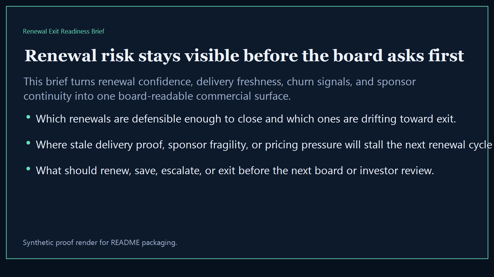
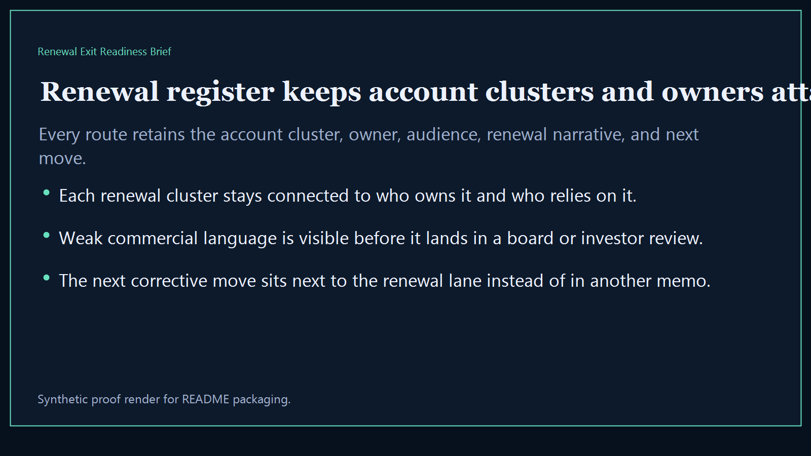
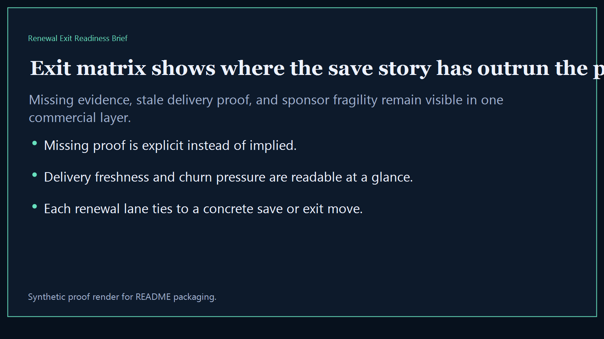
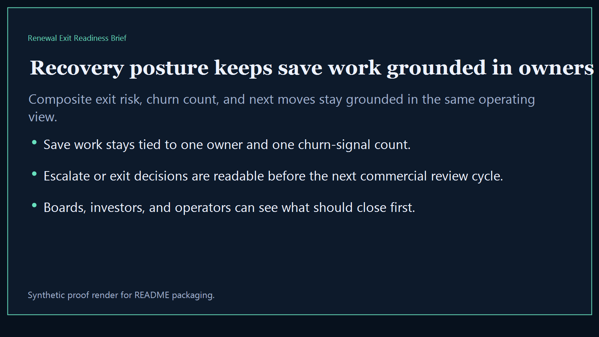

# Renewal Exit Readiness Brief

Board-ready executive-intelligence surface for showing where renewals are defensible, where exits are likely, and what leaders need to close before the next commercial review cycle.

- Live: `https://renewal.kineticgain.com/`
- Repo: `mizcausevic-dev/renewal-exit-readiness-brief`

## Why this matters

Leaders need one renewal surface that shows which accounts are safe to defend, which ones are drifting toward exit, and where commercial proof, ownership continuity, and remediation sequencing are too weak for the next board or investor review.

## What it includes

- TypeScript executive-intelligence surface for renewal readiness, exit pressure, commercial proof, and owner accountability
- synthetic lanes across renewal risk, expansion strength, delivery posture, trust continuity, pricing pressure, and executive sponsorship
- reusable outputs for renewal register, exit matrix, recovery posture, and board-ready commercial narratives
- prerendered static site, JSON payloads, screenshots, and docs

## Routes

- `/`
- `/renewal-register`
- `/exit-matrix`
- `/recovery-posture`
- `/verification`
- `/docs`

## Local run

```bash
cd renewal-exit-readiness-brief
npm install
npm run verify
npm run prerender
npm run render:assets
```

## CLI

```bash
npx renewal-exit-readiness-brief fixtures/renewal-exit-readiness-brief.json --format summary
npx renewal-exit-readiness-brief fixtures/renewal-exit-readiness-brief-clean.json --format json
```

## Docs

- [Architecture](docs/architecture.md)
- [Origin](docs/ORIGIN.md)
- [Kinetic Gain Embedded](docs/KINETIC_GAIN_EMBEDDED.md)

## Screenshots





